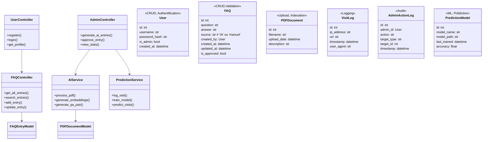

# Backend Class Diagram

```mermaid
classDiagram
    class UserController {
        +register()
        +login()
        +get_profile()
    }

    class FAQController {
        +get_all_entries()
        +search_entries()
        +add_entry()
        +update_entry()
    }

    class AdminController {
        +generate_ai_entries()
        +approve_entry()
        +view_stats()
    }

    class AIService {
        +process_pdf()
        +generate_embeddings()
        +generate_qa_pair()
    }

    class PredictionService {
        +log_visit()
        +train_model()
        +predict_visits()
    }

    class User {
        id: int
        username: str
        password_hash: str
        is_admin: bool
        created_at: datetime
        <<CRUD, Authentification>>
    }

    class FAQ {
        id: int
        question: str
        answer: str
        source: str  # 'IA' ou 'manuel'
        created_by: User
        created_at: datetime
        updated_at: datetime
        is_approved: bool
        <<CRUD,Validation>>
    }

    class PDFDocument {
        id: int
        filename: str
        upload_date: datetime
        description: str
        <<Upload, Indexation>>
    }

    class VisitLog {
        id: int
        ip_address: str
        url: str
        timestamp: datetime
        user_agent: str
        <<Logging>>
    }

    class AdminActionLog {
        id: int
        admin_id: User
        action: str
        target_type: str
        target_id: int
        timestamp: datetime
        <<Audit>>
    }

    class PredictionModel {
        id: int
        model_name: str
        model_path: str
        last_trained: datetime
        accuracy: float
        <<ML, Prédiction>>
    }

    UserController --> FAQController
    AdminController --> AIService
    AdminController --> PredictionService
    AIService --> PDFDocumentModel
    FAQController --> FAQEntryModel
```
