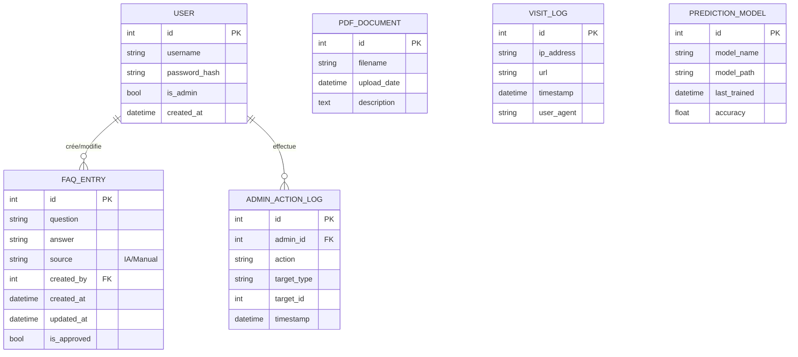

```mermaid
erDiagram
    USER ||--o{ FAQ_ENTRY : "crée/modifie"
    USER ||--o{ ADMIN_ACTION_LOG : "effectue"
    USER {
        int id PK
        string username
        string password_hash
        bool is_admin
        datetime created_at
    }

    FAQ_ENTRY {
        int id PK
        string question
        string answer
        string source "IA/Manual"
        int created_by FK
        datetime created_at
        datetime updated_at
        bool is_approved
    }

    PDF_DOCUMENT {
        int id PK
        string filename
        datetime upload_date
        text description
    }

    VISIT_LOG {
        int id PK
        string ip_address
        string url
        datetime timestamp
        string user_agent
    }

    ADMIN_ACTION_LOG {
        int id PK
        int admin_id FK
        string action
        string target_type
        int target_id
        datetime timestamp
    }

    PREDICTION_MODEL {
        int id PK
        string model_name
        string model_path
        datetime last_trained
        float accuracy
    }
```
